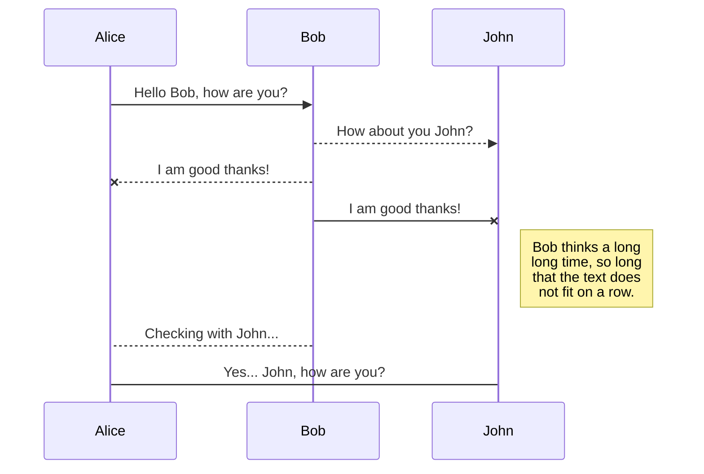
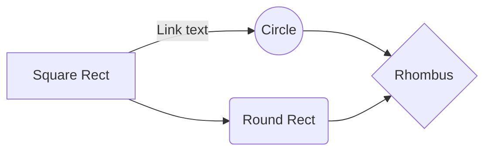

# VP_Negocios_Patrimoniales

# Welcome to StackEdit!

Hi! I'm your first Markdown file in **StackEdit**. If you want to learn about StackEdit, you can read me. If you want to play with Markdown, you can edit me. Once you have finished with me, you can create new files by opening the **file explorer** on the left corner of the navigation bar.

 
```sql
--CONTEO_SINIESTROS

SELECT  CAST(FECHA_MOVIMIENTO  AS  DATE)FECHA_MOVIMIENTO,

ALTURA,

TIPO_PRODUCTO,

TIPO_VEHICULO,

SUM(NS_TOTAL)NS_TOTAL,

SUM(NS_PPD)NS_PPD,

SUM(NS_PPH)NS_PPH,

SUM(NS_PTD)NS_PTD,

SUM(NS_PTH)NS_PTH,

SUM(NS_CAA)NS_CAA,

SUM(NS_DBT)NS_DBT,

SUM(NS_LM)NS_LM,

SUM(NS_PJS)NS_PJS,

SUM(NS_GSJ_PJS)NS_GSJ_PJS, --ojo

SUM(NS_RENTA)NS_RENTA,

SUM(NS_PAC)NS_PAC,

SUM(NS_VHR)NS_VHR,

SUM(NS_GASTOS_RCE)NS_GASTOS_RCE,

SUM(NS_GASTOS_RCE_DBT)NS_GASTOS_RCE_DBT,

SUM(NS_GASTOS_RCE_LM)NS_GASTOS_RCE_LM,

SUM(NS_GASTOS_RCE_OTROS)NS_GASTOS_RCE_OTROS,

SUM(NS_GASTOS_CASCO)NS_GASTOS_CASCO,

SUM(NS_GASTOS_CASCO_PP)NS_GASTOS_CASCO_PP,

SUM(NS_GASTOS_CASCO_PT)NS_GASTOS_CASCO_PT,

SUM(NS_RSS)NS_RSS,

SUM(NS_RES)NS_RES

  

FROM(

  
  

WITH  SINIESTROS  AS(

SELECT  DATE_TRUNC(T1.FECHA_MOVIMIENTO, MONTH)  AS  FECHA_MOVIMIENTO, T1.NUMERO_SINIESTRO ,

T1.CODIGO_SUBPRODUCTO,

T1.NUMERO_POLIZA,

T1.CODIGO_RIESGO,

FROM  (SELECT

MIN(FECHA_MOVIMIENTO)  AS  FECHA_MOVIMIENTO,

NUMERO_SINIESTRO,

CODIGO_SUBPRODUCTO,

NUMERO_POLIZA,

CODIGO_RIESGO,

CASE  WHEN  CODIGO_CONCEPTO_RESERVA  IS  NOT  NULL  THEN  'TOTAL'  ELSE  'OTROS'

END  AS  RESERVA_TOTAL,

CASE  WHEN  EXPEDIENTE  IN  ('PPD')  AND  CODIGO_COBERTURA  IN  (372)  AND  CODIGO_CONCEPTO_RESERVA  IN  (8,40)  THEN  'PPD'  ELSE  'OTROS'

END  AS  RESERVA_PPD,

CASE  WHEN  EXPEDIENTE  IN  ('PTD')  AND  CODIGO_COBERTURA  IN  (371)  AND  CODIGO_CONCEPTO_RESERVA  IN  (6)  THEN  'PTD'  ELSE  'OTROS'

END  AS  RESERVA_PTD,

CASE  WHEN  EXPEDIENTE  IN  ('PPH')  AND  CODIGO_COBERTURA  IN  (374)  AND  CODIGO_CONCEPTO_RESERVA  IN  (9,29)  THEN  'PPH'  ELSE  'OTROS'

END  AS  RESERVA_PPH,

CASE  WHEN  EXPEDIENTE  IN  ('PTH')  AND  CODIGO_COBERTURA  IN  (374)  AND  CODIGO_CONCEPTO_RESERVA  IN  (7)  THEN  'PTH'  ELSE  'OTROS'

END  AS  RESERVA_PTH,

CASE  WHEN  EXPEDIENTE  IN  ('CAA')  AND  CODIGO_COBERTURA  IN  (220)  AND  CODIGO_CONCEPTO_RESERVA  IN  (40)  THEN  'CAA'  ELSE  'OTROS'  END  AS  RESERVA_CAA,

CASE  WHEN  CODIGO_CONCEPTO_RESERVA  IN  (1)  THEN  'DBT'  ELSE  'OTROS'

END  AS  RESERVA_DBT,

CASE  WHEN  EXPEDIENTE  IN  ('LE1','LM1','MT1','LE2','MT2','AJE')  AND  CODIGO_CONCEPTO_RESERVA  IN  (2,3,92)  THEN  'LM'  ELSE  'OTROS'

END  AS  RESERVA_LM,

CASE  WHEN  EXPEDIENTE  IN  ('PJS')  AND  CODIGO_CONCEPTO_RESERVA = 62  THEN  'PJS'  ELSE  'OTROS'

END  AS  RESERVA_PJS,

CASE  WHEN  EXPEDIENTE  IN  ('GSJ')  AND  CODIGO_CONCEPTO_RESERVA = 62  THEN  'GSJ_PJS'  ELSE  'OTROS'

END  AS  RESERVA_GSJ_PJS,

CASE  WHEN  EXPEDIENTE  IN  ('NTA','PTD','PTH')  AND  CODIGO_CONCEPTO_RESERVA  IN  (8,9,24,29)  THEN  'RENTA'  ELSE  'OTROS'  --se añadió expediente y más código reserva

END  AS  RESERVA_RENTA,

CASE  WHEN  CODIGO_COBERTURA  IN  (450)  THEN  'PAC'  ELSE  'OTROS'

END  AS  RESERVA_PAC,

CASE  WHEN  CODIGO_CONCEPTO_RESERVA  NOT  IN  (1,0,2,3,6,7,8,40,9,29,62,24)  AND  CODIGO_COBERTURA  NOT  IN  (450,206,365,370,427)  AND  EXPEDIENTE  NOT  IN  ('GSO','GSJ')  THEN  'VHR'  ELSE  'OTROS'  END  AS  RESERVA_VHR,

CASE  WHEN  EXPEDIENTE  IN  ('GSO','GSJ')  AND  CODIGO_COBERTURA  IN  (206,365,370,427)  THEN  'GASTOS_RCE'  ELSE  'OTROS'  END  AS  RESERVA_GASTOS_RCE,

--CASE WHEN CODIGO_CONCEPTO_RESERVA = 11 AND EXPEDIENTE IN ('GSO') AND CODIGO_COBERTURA IN (427) THEN 'GASTOS_RCE' ELSE 'OTROS' END AS RESERVA_GASTOS_RCE,

--EXPEDIENTE IN ('GSO','GSJ') AND

CASE  WHEN  CODIGO_COBERTURA  IN  (206,365,370,427)  AND  CODIGO_CONCEPTO_RESERVA  IN  (1)  THEN  'GASTOS_RCE_DBT'  ELSE  'OTROS'  END  AS  RESERVA_GASTOS_RCE_DBT,

CASE  WHEN  EXPEDIENTE  IN  ('GSO','GSJ')  AND  CODIGO_COBERTURA  IN  (365,370,427)  AND  CODIGO_CONCEPTO_RESERVA  IN  (2,3,6,8,9,62,69)  THEN  'GASTOS_RCE_LM'  ELSE  'OTROS'  END  AS  RESERVA_GASTOS_RCE_LM,

CASE  WHEN  EXPEDIENTE  IN  ('GSO','GSJ')  AND  CODIGO_COBERTURA  IN  (206,365,370,427)  AND  CODIGO_CONCEPTO_RESERVA  NOT  IN  (0,1,2,3)  THEN  'GASTOS_RCE_OTROS'  ELSE  'OTROS'  END  AS  RESERVA_GASTOS_RCE_OTROS,

CASE  WHEN  EXPEDIENTE  IN  ('GSO','GSJ')  AND  CODIGO_COBERTURA  NOT  IN  (206,365,370,427)  THEN  'GASTOS_CASCO'  ELSE  'OTROS'

END  AS  RESERVA_GASTOS_CASCO,

--CASE WHEN EXPEDIENTE IN ('GSO','GSJ') AND CODIGO_COBERTURA NOT IN (206,365,370,427) AND CODIGO_CONCEPTO_RESERVA IN (8,40,9,29) THEN 'GASTOS_CASCO_PP' ELSE 'OTROS' END AS RESERVA_GASTOS_CASCO_PP,

--CASE WHEN EXPEDIENTE IN ('GSO','GSJ') AND CODIGO_COBERTURA NOT IN (206,365,370,427) AND CODIGO_CONCEPTO_RESERVA IN (6,7) THEN 'GASTOS_CASCO_PT' ELSE 'OTROS' END AS RESERVA_GASTOS_CASCO_PT,

--CASE WHEN EXPEDIENTE IN ('GSO','GSJ') AND CODIGO_COBERTURA NOT IN (41,216,372,374,427) AND CODIGO_CONCEPTO_RESERVA IN (8,9,11,62,69) THEN 'GASTOS_CASCO_PP' ELSE 'OTROS' END AS RESERVA_GASTOS_CASCO_PP,

CASE  WHEN  EXPEDIENTE  IN  ('GSO','GSJ')  AND  CODIGO_COBERTURA  NOT  IN  (206,365,370,427)  AND  CODIGO_CONCEPTO_RESERVA  IN  (8,40,9,29)  THEN  'GASTOS_CASCO_PP'  ELSE  'OTROS'  END  AS  RESERVA_GASTOS_CASCO_PP,

CASE  WHEN  EXPEDIENTE  IN  ('GSO','GSJ')  AND  CODIGO_COBERTURA  NOT  IN  (206,365,370,427)  AND  CODIGO_CONCEPTO_RESERVA  IN  (6,7)  THEN  'GASTOS_CASCO_PT'  ELSE  'OTROS'  END  AS  RESERVA_GASTOS_CASCO_PT,

CASE  WHEN  EXPEDIENTE  IN  ('RSS')  AND  CODIGO_CONCEPTO_RESERVA  IN  (1,6,7)  THEN  'RSS'  ELSE  'OTROS'

END  AS  RESERVA_RSS,

CASE  WHEN  EXPEDIENTE  IN  ('RES')  AND  CODIGO_CONCEPTO_RESERVA  IN  (1,2,6,7,8)  THEN  'RES'  ELSE  'OTROS'

END  AS  RESERVA_RES,

  

FROM  `sb-ecosistemaanalitico-lago.seguros_bolivar.t_siniestros`

WHERE  CODIGO_COMPANIA = 3

AND  CODIGO_RAMO_EMISION = 1

GROUP  BY  2,3,4,5,6,7,8,9,10,11,12,13,14,15,16,17,18,19,20,21,22,23,24,25,26,27)T1

ORDER  BY  1),

  

INCURRIDO  AS(

SELECT  FECHA_MOVIMIENTO, NUMERO_SINIESTRO,RESERVA_TOTAL,RESERVA_PPD,RESERVA_PPH,RESERVA_PTD,RESERVA_PTH,RESERVA_CAA,

RESERVA_DBT,RESERVA_LM,RESERVA_PJS,RESERVA_GSJ_PJS,RESERVA_RENTA,RESERVA_PAC,RESERVA_VHR,RESERVA_GASTOS_CASCO,RESERVA_GASTOS_CASCO_PP,RESERVA_GASTOS_CASCO_PT,RESERVA_GASTOS_RCE,RESERVA_GASTOS_RCE_DBT,RESERVA_GASTOS_RCE_LM,RESERVA_GASTOS_RCE_OTROS,RESERVA_RSS,RESERVA_RES,

ROW_NUMBER()  OVER

(PARTITION  BY  RESERVA_TOTAL,NUMERO_SINIESTRO

ORDER  BY  FECHA_MOVIMIENTO)  AS  INDICATIVO_RESERVA_TOTAL,

ROW_NUMBER()  OVER

(PARTITION  BY  RESERVA_PPD,NUMERO_SINIESTRO

ORDER  BY  FECHA_MOVIMIENTO)  AS  INDICATIVO_RESERVA_PPD,

ROW_NUMBER()  OVER

(PARTITION  BY  RESERVA_PTD,NUMERO_SINIESTRO

ORDER  BY  FECHA_MOVIMIENTO)  AS  INDICATIVO_RESERVA_PTD,

ROW_NUMBER()  OVER

(PARTITION  BY  RESERVA_PPH,NUMERO_SINIESTRO

ORDER  BY  FECHA_MOVIMIENTO)  AS  INDICATIVO_RESERVA_PPH,

ROW_NUMBER()  OVER

(PARTITION  BY  RESERVA_PTH,NUMERO_SINIESTRO

ORDER  BY  FECHA_MOVIMIENTO)  AS  INDICATIVO_RESERVA_PTH,

ROW_NUMBER()  OVER

(PARTITION  BY  RESERVA_CAA,NUMERO_SINIESTRO

ORDER  BY  FECHA_MOVIMIENTO)  AS  INDICATIVO_RESERVA_CAA,

ROW_NUMBER()  OVER

(PARTITION  BY  RESERVA_DBT,NUMERO_SINIESTRO

ORDER  BY  FECHA_MOVIMIENTO)  AS  INDICATIVO_RESERVA_DBT,

ROW_NUMBER()  OVER

(PARTITION  BY  RESERVA_LM,NUMERO_SINIESTRO

ORDER  BY  FECHA_MOVIMIENTO)  AS  INDICATIVO_RESERVA_LM,

ROW_NUMBER()  OVER

(PARTITION  BY  RESERVA_PJS,NUMERO_SINIESTRO

ORDER  BY  FECHA_MOVIMIENTO)  AS  INDICATIVO_RESERVA_PJS,

ROW_NUMBER()  OVER

(PARTITION  BY  RESERVA_GSJ_PJS,NUMERO_SINIESTRO

ORDER  BY  FECHA_MOVIMIENTO)  AS  INDICATIVO_RESERVA_GSJ_PJS,

ROW_NUMBER()  OVER

(PARTITION  BY  RESERVA_RENTA,NUMERO_SINIESTRO

ORDER  BY  FECHA_MOVIMIENTO)  AS  INDICATIVO_RESERVA_RENTA,

ROW_NUMBER()  OVER

(PARTITION  BY  RESERVA_PAC,NUMERO_SINIESTRO

ORDER  BY  FECHA_MOVIMIENTO)  AS  INDICATIVO_RESERVA_PAC,

ROW_NUMBER()  OVER

(PARTITION  BY  RESERVA_GASTOS_CASCO,NUMERO_SINIESTRO

ORDER  BY  FECHA_MOVIMIENTO)  AS  INDICATIVO_RESERVA_GASTOS_CASCO,

ROW_NUMBER()  OVER

(PARTITION  BY  RESERVA_GASTOS_CASCO_PP,NUMERO_SINIESTRO

ORDER  BY  FECHA_MOVIMIENTO)  AS  INDICATIVO_RESERVA_GASTOS_CASCO_PP,

ROW_NUMBER()  OVER

(PARTITION  BY  RESERVA_GASTOS_CASCO_PT,NUMERO_SINIESTRO

ORDER  BY  FECHA_MOVIMIENTO)  AS  INDICATIVO_RESERVA_GASTOS_CASCO_PT,

ROW_NUMBER()  OVER

(PARTITION  BY  RESERVA_GASTOS_CASCO,NUMERO_SINIESTRO

ORDER  BY  FECHA_MOVIMIENTO)  AS  INDICATIVO_RESERVA_GASTOS_RCE,

ROW_NUMBER()  OVER

(PARTITION  BY  RESERVA_GASTOS_RCE_DBT,NUMERO_SINIESTRO

ORDER  BY  FECHA_MOVIMIENTO)  AS  INDICATIVO_RESERVA_GASTOS_RCE_DBT,

ROW_NUMBER()  OVER

(PARTITION  BY  RESERVA_GASTOS_RCE_LM,NUMERO_SINIESTRO

ORDER  BY  FECHA_MOVIMIENTO)  AS  INDICATIVO_RESERVA_GASTOS_RCE_LM,

ROW_NUMBER()  OVER

(PARTITION  BY  RESERVA_GASTOS_RCE_OTROS,NUMERO_SINIESTRO

ORDER  BY  FECHA_MOVIMIENTO)  AS  INDICATIVO_RESERVA_GASTOS_RCE_OTROS,

ROW_NUMBER()  OVER

(PARTITION  BY  RESERVA_VHR,NUMERO_SINIESTRO

ORDER  BY  FECHA_MOVIMIENTO)  AS  INDICATIVO_RESERVA_VHR,

ROW_NUMBER()  OVER

(PARTITION  BY  RESERVA_RSS,NUMERO_SINIESTRO

ORDER  BY  FECHA_MOVIMIENTO)  AS  INDICATIVO_RESERVA_RSS,

ROW_NUMBER()  OVER

(PARTITION  BY  RESERVA_RES,NUMERO_SINIESTRO

ORDER  BY  FECHA_MOVIMIENTO)  AS  INDICATIVO_RESERVA_RES,

SUM(if(RESERVA_TOTAL = 'TOTAL', IFNULL(T2.INCURRIDO_BOLIVAR,0), NULL))  AS  S_TOTAL,

SUM(if(RESERVA_PPD = 'PPD', IFNULL(T2.INCURRIDO_BOLIVAR,0), NULL))  as  S_PPD,

SUM(if(RESERVA_PPH = 'PPH', IFNULL(T2.INCURRIDO_BOLIVAR,0), NULL))  as  S_PPH,

SUM(if(RESERVA_PTD = 'PTD', IFNULL(T2.INCURRIDO_BOLIVAR,0), NULL))  as  S_PTD,

SUM(if(RESERVA_PTH = 'PTH', IFNULL(T2.INCURRIDO_BOLIVAR,0), NULL))  as  S_PTH,

SUM(if(RESERVA_CAA = 'CAA', IFNULL(T2.INCURRIDO_BOLIVAR,0), NULL))  as  S_CAA,

SUM(if(RESERVA_DBT = 'DBT', IFNULL(T2.INCURRIDO_BOLIVAR,0), NULL))  as  S_DBT,

SUM(if(RESERVA_LM = 'LM', IFNULL(T2.INCURRIDO_BOLIVAR,0), NULL))  as  S_LM,

SUM(if(RESERVA_PJS = 'PJS', IFNULL(T2.INCURRIDO_BOLIVAR,0), NULL))  as  S_PJS,

SUM(if(RESERVA_GSJ_PJS = 'GSJ_PJS', IFNULL(T2.INCURRIDO_BOLIVAR,0), NULL))  as  S_GSJ_PJS,

SUM(if(RESERVA_RENTA = 'RENTA', IFNULL(T2.INCURRIDO_BOLIVAR,0), NULL))  as  S_RENTA,

SUM(if(RESERVA_VHR = 'VHR', IFNULL(T2.INCURRIDO_BOLIVAR,0), NULL))  as  S_VHR,

SUM(if(RESERVA_PAC = 'PAC', IFNULL(T2.INCURRIDO_BOLIVAR,0), NULL))  as  S_PAC,

SUM(if(RESERVA_GASTOS_CASCO = 'GASTOS_CASCO', IFNULL(T2.INCURRIDO_BOLIVAR,0), NULL))  as  S_GASTOS_CASCO,

SUM(if(RESERVA_GASTOS_CASCO_PP = 'GASTOS_CASCO_PP', IFNULL(T2.INCURRIDO_BOLIVAR,0), NULL))  as  S_GASTOS_CASCO_PP,

SUM(if(RESERVA_GASTOS_CASCO_PT = 'GASTOS_CASCO_PT', IFNULL(T2.INCURRIDO_BOLIVAR,0), NULL))  as  S_GASTOS_CASCO_PT,

SUM(if(RESERVA_GASTOS_RCE = 'GASTOS_RCE', IFNULL(T2.INCURRIDO_BOLIVAR,0), NULL))  as  S_GASTOS_RCE,

SUM(if(RESERVA_GASTOS_RCE_DBT = 'GASTOS_RCE_DBT', IFNULL(T2.INCURRIDO_BOLIVAR,0), NULL))  as  S_GASTOS_RCE_DBT,

SUM(if(RESERVA_GASTOS_RCE_LM = 'GASTOS_RCE_LM', IFNULL(T2.INCURRIDO_BOLIVAR,0), NULL))  as  S_GASTOS_RCE_LM,

SUM(if(RESERVA_GASTOS_RCE_OTROS = 'GASTOS_RCE_OTROS', IFNULL(T2.INCURRIDO_BOLIVAR,0), NULL))  as  S_GASTOS_RCE_OTROS,

SUM(if(RESERVA_RSS = 'RSS', IFNULL(T2.INCURRIDO_BOLIVAR,0), NULL))  as  S_RSS,

SUM(if(RESERVA_RES = 'RES', IFNULL(T2.INCURRIDO_BOLIVAR,0), NULL))  as  S_RES,

  
  

FROM(

SELECT  DATE_TRUNC(FECHA_MOVIMIENTO, MONTH)  AS  FECHA_MOVIMIENTO,

NUMERO_SINIESTRO,

INCURRIDO_BOLIVAR,

CASE  WHEN  CODIGO_CONCEPTO_RESERVA  IS  NOT  NULL  THEN  'TOTAL'  ELSE  'OTROS'

END  AS  RESERVA_TOTAL,

CASE  WHEN  EXPEDIENTE  IN  ('PPD')  AND  CODIGO_COBERTURA  IN  (372,373)  AND  CODIGO_CONCEPTO_RESERVA  IN  (8)  THEN  'PPD'  ELSE  'OTROS'

END  AS  RESERVA_PPD,

CASE  WHEN  EXPEDIENTE  IN  ('PTD')  AND  CODIGO_COBERTURA  IN  (371)  AND  CODIGO_CONCEPTO_RESERVA  IN  (6)  THEN  'PTD'  ELSE  'OTROS'

END  AS  RESERVA_PTD,

CASE  WHEN  EXPEDIENTE  IN  ('PPH')  AND  CODIGO_COBERTURA  IN  (374)  AND  CODIGO_CONCEPTO_RESERVA  IN  (7,9)  THEN  'PPH'  ELSE  'OTROS'

END  AS  RESERVA_PPH,

CASE  WHEN  EXPEDIENTE  IN  ('PTH')  AND  CODIGO_COBERTURA  IN  (374)  AND  CODIGO_CONCEPTO_RESERVA  IN  (7)  THEN  'PTH'  ELSE  'OTROS'

END  AS  RESERVA_PTH,

CASE  WHEN  EXPEDIENTE  IN  ('CAA')  AND  CODIGO_COBERTURA  IN  (220)  AND  CODIGO_CONCEPTO_RESERVA  IN  (40)  THEN  'CAA'  ELSE  'OTROS'

END  AS  RESERVA_CAA,

CASE  WHEN  CODIGO_CONCEPTO_RESERVA  IN  (1)  THEN  'DBT'  ELSE  'OTROS'

END  AS  RESERVA_DBT,

CASE  WHEN  EXPEDIENTE  IN  ('LE1','LM1','MT1','LE2','MT2','AJE')  AND  CODIGO_CONCEPTO_RESERVA  IN  (2,3,92)  THEN  'LM'  ELSE  'OTROS'

END  AS  RESERVA_LM,

CASE  WHEN  EXPEDIENTE  IN  ('PJS')  AND  CODIGO_CONCEPTO_RESERVA = 62  THEN  'PJS'  ELSE  'OTROS'

END  AS  RESERVA_PJS,

CASE  WHEN  EXPEDIENTE  IN  ('GSJ')  AND  CODIGO_CONCEPTO_RESERVA = 62  THEN  'GSJ_PJS'  ELSE  'OTROS'

END  AS  RESERVA_GSJ_PJS,

CASE  WHEN  EXPEDIENTE  IN  ('NTA','PTD','PTH')  AND  CODIGO_CONCEPTO_RESERVA  IN  (8,9,24,29)  THEN  'RENTA'  ELSE  'OTROS'

END  AS  RESERVA_RENTA,

CASE  WHEN  CODIGO_COBERTURA  IN  (450)  THEN  'PAC'  ELSE  'OTROS'

END  AS  RESERVA_PAC,

CASE  WHEN  CODIGO_CONCEPTO_RESERVA  NOT  IN  (1,0,2,3,6,7,8,40,9,29,62,24)  AND  CODIGO_COBERTURA  NOT  IN  (450,206,365,370,427)  AND  EXPEDIENTE  NOT  IN  ('GSO','GSJ')  THEN  'VHR'  ELSE  'OTROS'  END  AS  RESERVA_VHR,

CASE  WHEN  EXPEDIENTE  IN  ('GSO','GSJ')  AND  CODIGO_COBERTURA  IN  (206,365,370,427)  THEN  'GASTOS_RCE'  ELSE  'OTROS'  END  AS  RESERVA_GASTOS_RCE,--EXPEDIENTE IN ('GSO','GSJ') AND

CASE  WHEN  CODIGO_COBERTURA  IN  (206,365,370,427)  AND  CODIGO_CONCEPTO_RESERVA  IN  (1)  THEN  'GASTOS_RCE_DBT'  ELSE  'OTROS'  END  AS  RESERVA_GASTOS_RCE_DBT,

CASE  WHEN  EXPEDIENTE  IN  ('GSO','GSJ')  AND  CODIGO_COBERTURA  IN  (365,370,427)  AND  CODIGO_CONCEPTO_RESERVA  IN  (2,3,6,8,9,62,69)  THEN  'GASTOS_RCE_LM'  ELSE  'OTROS'  END  AS  RESERVA_GASTOS_RCE_LM,

CASE  WHEN  EXPEDIENTE  IN  ('GSO','GSJ')  AND  CODIGO_COBERTURA  IN  (206,365,370,427)  AND  CODIGO_CONCEPTO_RESERVA  NOT  IN  (0,1,2,3)  THEN  'GASTOS_RCE_OTROS'  ELSE  'OTROS'  END  AS  RESERVA_GASTOS_RCE_OTROS,

CASE  WHEN  EXPEDIENTE  IN  ('GSO','GSJ')  AND  CODIGO_COBERTURA  NOT  IN  (206,365,370,427)  THEN  'GASTOS_CASCO'  ELSE  'OTROS'

END  AS  RESERVA_GASTOS_CASCO,

CASE  WHEN  EXPEDIENTE  IN  ('GSO','GSJ')  AND  CODIGO_COBERTURA  NOT  IN  (206,365,370,427)  AND  CODIGO_CONCEPTO_RESERVA  IN  (8,40,9,29)  THEN  'GASTOS_CASCO_PP'  ELSE  'OTROS'  END  AS  RESERVA_GASTOS_CASCO_PP,

CASE  WHEN  EXPEDIENTE  IN  ('GSO','GSJ')  AND  CODIGO_COBERTURA  NOT  IN  (206,365,370,427)  AND  CODIGO_CONCEPTO_RESERVA  IN  (6,7)  THEN  'GASTOS_CASCO_PT'  ELSE  'OTROS'  END  AS  RESERVA_GASTOS_CASCO_PT,

CASE  WHEN  EXPEDIENTE  IN  ('RSS')  AND  CODIGO_CONCEPTO_RESERVA  IN  (1,6,7)  THEN  'RSS'  ELSE  'OTROS'

END  AS  RESERVA_RSS,

CASE  WHEN  EXPEDIENTE  IN  ('RES')  AND  CODIGO_CONCEPTO_RESERVA  IN  (1,2,6,7,8)  THEN  'RES'  ELSE  'OTROS'

END  AS  RESERVA_RES,

  

FROM  `sb-ecosistemaanalitico-lago.seguros_bolivar.t_siniestros`

WHERE  CODIGO_COMPANIA = 3

AND  CODIGO_RAMO_EMISION = 1)T2

GROUP  BY  1,2,3,4,5,6,7,8,9,10,11,12,13,14,15,16,17,18,19,20,21,22,23,24),

  

RIESGOS  AS(

SELECT  NUMERO_POLIZA, CODIGO_RIESGO, COD_TIPO

FROM(

SELECT  DISTINCT  NUMERO_POLIZA, CODIGO_RIESGO, COD_TIPO,FECHA_INICIO_ENDOSO,

ROW_NUMBER()  OVER

(PARTITION  BY  NUMERO_POLIZA,CODIGO_RIESGO

ORDER  BY  FECHA_INICIO_ENDOSO)  AS  CONSECUTIVO_TIPO, FROM  `sb-ecosistemaanalitico-lago.seguros_bolivar.t_autos_riesgos_endosos`

WHERE  COD_TIPO  IS  NOT  NULL)

WHERE  CONSECUTIVO_TIPO = 1

)

  

SELECT  DATE_TRUNC(T1.FECHA_MOVIMIENTO,MONTH)FECHA_MOVIMIENTO,

T1.NUMERO_SINIESTRO,

T1.NUMERO_POLIZA,

T1.CODIGO_RIESGO,

CASE  WHEN  RIGHT(CAST(T1.NUMERO_POLIZA  AS  STRING),2)='01'  THEN  'NN'  ELSE  'RN'  END  AS  ALTURA,

CASE  WHEN  T1.CODIGO_SUBPRODUCTO  IN  (251,263,274,374,376,360)  THEN  'INDIVIDUAL'

WHEN  T1.CODIGO_SUBPRODUCTO  IN  (368,370)  THEN  'RC_PAX'

WHEN  T1.CODIGO_SUBPRODUCTO  IN  (363)  THEN  'TRANSMILENIO'

ELSE  'COLECTIVO'  END  AS  TIPO_PRODUCTO,

CASE  WHEN  T3.COD_TIPO  IN  (1, 2, 6, 8, 20, 21, 32, 33)  THEN  'LIVIANO'

WHEN  T3.COD_TIPO  IN  (17,18,19)  THEN  'MOTO'

WHEN  T3.COD_TIPO  IN  (3)  THEN  'BUSES_BUSETA_MICROBUS'

ELSE  'PESADO'  END  AS  TIPO_VEHICULO,

T2.INDICATIVO_RESERVA_TOTAL,

T2.INDICATIVO_RESERVA_PPD,

T2.INDICATIVO_RESERVA_PTD,

T2.INDICATIVO_RESERVA_PPH,

T2.INDICATIVO_RESERVA_PTH,

T2.INDICATIVO_RESERVA_CAA,

T2.INDICATIVO_RESERVA_DBT,

T2.INDICATIVO_RESERVA_LM,

T2.INDICATIVO_RESERVA_PJS,

T2.INDICATIVO_RESERVA_GSJ_PJS,

T2.INDICATIVO_RESERVA_RENTA,

T2.INDICATIVO_RESERVA_PAC,

T2.INDICATIVO_RESERVA_VHR,

T2.INDICATIVO_RESERVA_GASTOS_CASCO,

T2.INDICATIVO_RESERVA_GASTOS_CASCO_PP,

T2.INDICATIVO_RESERVA_GASTOS_CASCO_PT,

T2.INDICATIVO_RESERVA_GASTOS_RCE,

T2.INDICATIVO_RESERVA_GASTOS_RCE_DBT,

T2.INDICATIVO_RESERVA_GASTOS_RCE_LM,

T2.INDICATIVO_RESERVA_GASTOS_RCE_OTROS,

T2.INDICATIVO_RESERVA_RSS,

T2.INDICATIVO_RESERVA_RES,

  

T2.RESERVA_TOTAL,

T2.RESERVA_PPD,

T2.RESERVA_PTD,

T2.RESERVA_PPH,

T2.RESERVA_PTH,

T2.RESERVA_CAA,

T2.RESERVA_DBT,

T2.RESERVA_LM,

T2.RESERVA_PJS,

T2.RESERVA_GSJ_PJS,

T2.RESERVA_RENTA,

T2.RESERVA_PAC,

T2.RESERVA_VHR,

T2.RESERVA_GASTOS_CASCO,

T2.RESERVA_GASTOS_CASCO_PP,

T2.RESERVA_GASTOS_CASCO_PT,

T2.RESERVA_GASTOS_RCE,

T2.RESERVA_GASTOS_RCE_DBT,

T2.RESERVA_GASTOS_RCE_LM,

T2.RESERVA_GASTOS_RCE_OTROS,

T2.RESERVA_RSS,

T2.RESERVA_RES,

CASE  WHEN  SUM(T2.S_TOTAL)>100  AND  T2.RESERVA_TOTAL = 'TOTAL'  AND  INDICATIVO_RESERVA_TOTAL = 1  THEN  1  ELSE  0  END  AS  NS_TOTAL,

CASE  WHEN  SUM(T2.S_PPD)>100  AND  T2.RESERVA_PPD = 'PPD'  AND  INDICATIVO_RESERVA_PPD = 1  THEN  1  ELSE  0  END  AS  NS_PPD,

CASE  WHEN  SUM(T2.S_PPH)>100  AND  T2.RESERVA_PPH = 'PPH'  AND  INDICATIVO_RESERVA_PPH = 1  THEN  1  ELSE  0  END  AS  NS_PPH,

CASE  WHEN  SUM(T2.S_PTD)>100  AND  T2.RESERVA_PTD = 'PTD'  AND  INDICATIVO_RESERVA_PTD = 1  THEN  1  ELSE  0  END  AS  NS_PTD,

CASE  WHEN  SUM(T2.S_PTH)>100  AND  T2.RESERVA_PTH = 'PTH'  AND  INDICATIVO_RESERVA_PTH = 1  THEN  1  ELSE  0  END  AS  NS_PTH,

CASE  WHEN  SUM(T2.S_CAA)>100  AND  T2.RESERVA_CAA = 'CAA'  AND  INDICATIVO_RESERVA_CAA = 1  THEN  1  ELSE  0  END  AS  NS_CAA,

CASE  WHEN  SUM(T2.S_DBT)>100  AND  T2.RESERVA_DBT = 'DBT'  AND  INDICATIVO_RESERVA_DBT = 1  THEN  1  ELSE  0  END  AS  NS_DBT,

CASE  WHEN  SUM(T2.S_LM)>100  AND  T2.RESERVA_LM = 'LM'  AND  INDICATIVO_RESERVA_LM = 1  THEN  1  ELSE  0  END  AS  NS_LM,

CASE  WHEN  SUM(T2.S_PJS)>100  AND  T2.RESERVA_PJS = 'PJS'  AND  INDICATIVO_RESERVA_PJS = 1  THEN  1  ELSE  0  END  AS  NS_PJS,

CASE  WHEN  SUM(T2.S_GSJ_PJS)>100  AND  T2.RESERVA_GSJ_PJS = 'GSJ_PJS'  AND  INDICATIVO_RESERVA_GSJ_PJS = 1  THEN  1  ELSE  0  END  AS  NS_GSJ_PJS,

CASE  WHEN  SUM(T2.S_RENTA)>100  AND  T2.RESERVA_RENTA = 'RENTA'  AND  INDICATIVO_RESERVA_RENTA = 1  THEN  1  ELSE  0  END  AS  NS_RENTA,

CASE  WHEN  SUM(T2.S_PAC)>100  AND  T2.RESERVA_PAC = 'PAC'  AND  INDICATIVO_RESERVA_PAC = 1  THEN  1  ELSE  0  END  AS  NS_PAC,

CASE  WHEN  SUM(T2.S_GASTOS_RCE)>100  AND  T2.RESERVA_GASTOS_RCE = 'GASTOS_RCE'  AND  INDICATIVO_RESERVA_GASTOS_RCE = 1  THEN  1  ELSE  0  END  AS  NS_GASTOS_RCE,

CASE  WHEN  SUM(T2.S_GASTOS_RCE_DBT)>100  AND  T2.RESERVA_GASTOS_RCE_DBT = 'GASTOS_RCE_DBT'  AND  INDICATIVO_RESERVA_GASTOS_RCE_DBT = 1  AND  INDICATIVO_RESERVA_GASTOS_RCE = 1  THEN  1  ELSE  0  END  AS  NS_GASTOS_RCE_DBT,

CASE  WHEN  SUM(T2.S_GASTOS_RCE_LM)>100  AND  T2.RESERVA_GASTOS_RCE_LM = 'GASTOS_RCE_LM'  AND  INDICATIVO_RESERVA_GASTOS_RCE_LM = 1  AND  INDICATIVO_RESERVA_GASTOS_RCE = 1  THEN  1  ELSE  0  END  AS  NS_GASTOS_RCE_LM,

CASE  WHEN  SUM(T2.S_GASTOS_RCE_OTROS)>100  AND  T2.RESERVA_GASTOS_RCE_OTROS = 'GASTOS_RCE_OTROS'  AND  INDICATIVO_RESERVA_GASTOS_RCE_OTROS = 1  AND  INDICATIVO_RESERVA_GASTOS_RCE = 1  THEN  1  ELSE  0  END  AS  NS_GASTOS_RCE_OTROS,

CASE  WHEN  SUM(T2.S_GASTOS_CASCO)>100  AND  T2.RESERVA_GASTOS_CASCO = 'GASTOS_CASCO'  AND  INDICATIVO_RESERVA_GASTOS_CASCO = 1  THEN  1  ELSE  0  END  AS  NS_GASTOS_CASCO,

CASE  WHEN  SUM(T2.S_GASTOS_CASCO_PP)>100  AND  T2.RESERVA_GASTOS_CASCO_PP = 'GASTOS_CASCO_PP'  AND  INDICATIVO_RESERVA_GASTOS_CASCO_PP = 1  AND  INDICATIVO_RESERVA_GASTOS_CASCO = 1  THEN  1  ELSE  0  END  AS  NS_GASTOS_CASCO_PP,

CASE  WHEN  SUM(T2.S_GASTOS_CASCO_PT)>100  AND  T2.RESERVA_GASTOS_CASCO_PT = 'GASTOS_CASCO_PT'  AND  INDICATIVO_RESERVA_GASTOS_CASCO_PT = 1  AND  INDICATIVO_RESERVA_GASTOS_CASCO = 1  THEN  1  ELSE  0  END  AS  NS_GASTOS_CASCO_PT,

CASE  WHEN  SUM(T2.S_VHR)>100  AND  T2.RESERVA_VHR = 'VHR'  AND  INDICATIVO_RESERVA_VHR = 1  THEN  1  ELSE  0  END  AS  NS_VHR,

CASE  WHEN  SUM(T2.S_RSS)>100  AND  T2.RESERVA_RSS = 'RSS'  AND  INDICATIVO_RESERVA_RSS = 1  THEN  1  ELSE  0  END  AS  NS_RSS,

CASE  WHEN  SUM(T2.S_RES)>100  AND  T2.RESERVA_RES = 'RES'  AND  INDICATIVO_RESERVA_RES = 1  THEN  1  ELSE  0  END  AS  NS_RES,

SUM(T2.S_TOTAL)S_TOTAL,

SUM(T2.S_PPD)S_PPD,

SUM(T2.S_PPH)S_PPH,

SUM(T2.S_PTD)S_PTD,

SUM(T2.S_PTH)S_PTH,

SUM(T2.S_CAA)S_CAA,

SUM(T2.S_DBT)S_DBT,

SUM(T2.S_LM)S_LM,

SUM(T2.S_PJS)S_PJS,

SUM(T2.S_GSJ_PJS)S_GSJ_PJS,

SUM(T2.S_RENTA)S_RENTA,

SUM(T2.S_PAC)S_PAC,

SUM(T2.S_VHR)S_VHR,

SUM(T2.S_GASTOS_RCE)S_GASTOS_RCE,

SUM(T2.S_GASTOS_RCE_DBT)S_GASTOS_RCE_DBT,

SUM(T2.S_GASTOS_RCE_LM)S_GASTOS_RCE_LM,

SUM(T2.S_GASTOS_RCE_OTROS)S_GASTOS_RCE_OTROS,

SUM(T2.S_GASTOS_CASCO)S_GASTOS_CASCO,

SUM(T2.S_GASTOS_CASCO_PP)S_GASTOS_CASCO_PP,

SUM(T2.S_GASTOS_CASCO_PT)S_GASTOS_CASCO_PT,

SUM(T2.S_RSS)S_RSS,

SUM(T2.S_RES)S_RES,

  

FROM  SINIESTROS  AS  T1

  

LEFT  JOIN  INCURRIDO  T2

ON  T1.NUMERO_SINIESTRO = T2.NUMERO_SINIESTRO

AND  T1.FECHA_MOVIMIENTO = T2.FECHA_MOVIMIENTO

  

LEFT  JOIN  RIESGOS  T3

ON  T1.NUMERO_POLIZA = T3.NUMERO_POLIZA

AND  T1.CODIGO_RIESGO = T3.CODIGO_RIESGO

  

GROUP  BY  1,2,3,4,5,6,7,8,9,10,11,12,13,14,15,16,17,18,19,20,21,22,23,24,25,26,27,28,29,30,31,32,33,34,35,36,37,38,39,40,41,42,43,44,45,46,47,48,49,50,51

ORDER  BY  1

)WHERE  FECHA_MOVIMIENTO  BETWEEN  '2018-01-01'  AND  "2023-09-01"

GROUP  BY  1,2,3,4

ORDER  BY  1
```
# Files

StackEdit stores your files in your browser, which means all your files are automatically saved locally and are accessible **offline!**

## Create files and folders

The file explorer is accessible using the button in left corner of the navigation bar. You can create a new file by clicking the **New file** button in the file explorer. You can also create folders by clicking the **New folder** button.

## Switch to another file

All your files and folders are presented as a tree in the file explorer. You can switch from one to another by clicking a file in the tree.

## Rename a file

You can rename the current file by clicking the file name in the navigation bar or by clicking the **Rename** button in the file explorer.

## Delete a file

You can delete the current file by clicking the **Remove** button in the file explorer. The file will be moved into the **Trash** folder and automatically deleted after 7 days of inactivity.

## Export a file

You can export the current file by clicking **Export to disk** in the menu. You can choose to export the file as plain Markdown, as HTML using a Handlebars template or as a PDF.


# Synchronization

Synchronization is one of the biggest features of StackEdit. It enables you to synchronize any file in your workspace with other files stored in your **Google Drive**, your **Dropbox** and your **GitHub** accounts. This allows you to keep writing on other devices, collaborate with people you share the file with, integrate easily into your workflow... The synchronization mechanism takes place every minute in the background, downloading, merging, and uploading file modifications.

There are two types of synchronization and they can complement each other:

- The workspace synchronization will sync all your files, folders and settings automatically. This will allow you to fetch your workspace on any other device.
	> To start syncing your workspace, just sign in with Google in the menu.

- The file synchronization will keep one file of the workspace synced with one or multiple files in **Google Drive**, **Dropbox** or **GitHub**.
	> Before starting to sync files, you must link an account in the **Synchronize** sub-menu.

## Open a file

You can open a file from **Google Drive**, **Dropbox** or **GitHub** by opening the **Synchronize** sub-menu and clicking **Open from**. Once opened in the workspace, any modification in the file will be automatically synced.

## Save a file

You can save any file of the workspace to **Google Drive**, **Dropbox** or **GitHub** by opening the **Synchronize** sub-menu and clicking **Save on**. Even if a file in the workspace is already synced, you can save it to another location. StackEdit can sync one file with multiple locations and accounts.

## Synchronize a file

Once your file is linked to a synchronized location, StackEdit will periodically synchronize it by downloading/uploading any modification. A merge will be performed if necessary and conflicts will be resolved.

If you just have modified your file and you want to force syncing, click the **Synchronize now** button in the navigation bar.

> **Note:** The **Synchronize now** button is disabled if you have no file to synchronize.

## Manage file synchronization

Since one file can be synced with multiple locations, you can list and manage synchronized locations by clicking **File synchronization** in the **Synchronize** sub-menu. This allows you to list and remove synchronized locations that are linked to your file.


# Publication

Publishing in StackEdit makes it simple for you to publish online your files. Once you're happy with a file, you can publish it to different hosting platforms like **Blogger**, **Dropbox**, **Gist**, **GitHub**, **Google Drive**, **WordPress** and **Zendesk**. With [Handlebars templates](http://handlebarsjs.com/), you have full control over what you export.

> Before starting to publish, you must link an account in the **Publish** sub-menu.

## Publish a File

You can publish your file by opening the **Publish** sub-menu and by clicking **Publish to**. For some locations, you can choose between the following formats:

- Markdown: publish the Markdown text on a website that can interpret it (**GitHub** for instance),
- HTML: publish the file converted to HTML via a Handlebars template (on a blog for example).

## Update a publication

After publishing, StackEdit keeps your file linked to that publication which makes it easy for you to re-publish it. Once you have modified your file and you want to update your publication, click on the **Publish now** button in the navigation bar.

> **Note:** The **Publish now** button is disabled if your file has not been published yet.

## Manage file publication

Since one file can be published to multiple locations, you can list and manage publish locations by clicking **File publication** in the **Publish** sub-menu. This allows you to list and remove publication locations that are linked to your file.


# Markdown extensions

StackEdit extends the standard Markdown syntax by adding extra **Markdown extensions**, providing you with some nice features.

> **ProTip:** You can disable any **Markdown extension** in the **File properties** dialog.


## SmartyPants

SmartyPants converts ASCII punctuation characters into "smart" typographic punctuation HTML entities. For example:

|                |ASCII                          |HTML                         |
|----------------|-------------------------------|-----------------------------|
|Single backticks|`'Isn't this fun?'`            |'Isn't this fun?'            |
|Quotes          |`"Isn't this fun?"`            |"Isn't this fun?"            |
|Dashes          |`-- is en-dash, --- is em-dash`|-- is en-dash, --- is em-dash|


## KaTeX

You can render LaTeX mathematical expressions using [KaTeX](https://khan.github.io/KaTeX/):

The *Gamma function* satisfying $\Gamma(n) = (n-1)!\quad\forall n\in\mathbb N$ is via the Euler integral

$$
\Gamma(z) = \int_0^\infty t^{z-1}e^{-t}dt\,.
$$

> You can find more information about **LaTeX** mathematical expressions [here](http://meta.math.stackexchange.com/questions/5020/mathjax-basic-tutorial-and-quick-reference).


## UML diagrams

You can render UML diagrams using [Mermaid](https://mermaidjs.github.io/). For example, this will produce a sequence diagram:



And this will produce a flow chart:

